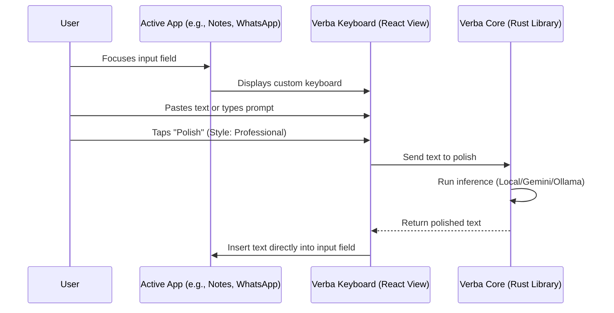

# Mobile Custom Keyboard & Multi-Platform Integration Plan

This document outlines the design strategy, technical challenges, and implementation path for bringing Verba to Android and iOS using Tauri v2.

---

## 1. Single Codebase vs. Separate Projects

We target all 4 platforms (Windows, macOS, iOS, Android) within a **single codebase and branch**.
Tauri v2 is specifically designed to unify desktop and mobile targets in one project. Maintaining one codebase prevents code duplication and ensures that core logic (API client handlers, local model settings, prompt templates, and history) is shared.

### Project Directory Structure
```text
Verba/
├── src/                      # Shared React Frontend (Desktop App & Mobile Keyboard UI)
├── src-tauri/
│   ├── Cargo.toml            # Multi-platform Rust dependencies
│   ├── src/
│   │   ├── lib.rs            # Entry point; platform-specific setups
│   │   ├── llama.rs          # Local LLM wrapper (process command on Desktop / static lib on Mobile)
│   │   └── main.rs           # Desktop wrapper
│   └── gen/                  # Automatically managed target setups
│       ├── android/          # Android Studio Project (Kotlin IME configuration)
│       └── apple/            # Xcode Project (Swift Keyboard Extension configuration)
```

---

## 2. Key Challenges & Technical Solutions

### A. Local Inference without Sidecars
*   **The Problem:** Desktop runs local inference by spawning a sidecar binary (`llama-completion`) via `std::process::Command`. **iOS forbids spawning child processes entirely.** Android also heavily restricts executing arbitrary subprocesses from the app workspace.
*   **The Solution:** Embed `llama.cpp` directly inside the Tauri Rust library (`verba_lib`). 
    *   Integrate a Rust crate like `llama-cpp-2` or run bindings directly to link with `libllama.a` / `libllama.so` statically.
    *   This compiles `llama.cpp` directly into the final application binary, executing model loading and generation in-process.

### B. Custom Keyboard Extension Feasibility & Architecture
Both platforms allow creating custom system keyboards. They act as sub-applications running inside a restricted sandboxed process spawned by the operating system when the keyboard is focused.
*   **iOS Keyboard Extension:** Uses `UIInputViewController` in Swift. Inside the Tauri Xcode project (`src-tauri/gen/apple`), we add a Custom Keyboard target that instantiates a webview pointing to `/keyboard` and bridges keys using Tauri's native Swift plugins.
*   **Android Input Method Editor (IME):** Uses `InputMethodService` in Kotlin. Inside the Android project (`src-tauri/gen/android`), we register a service that loads our React app's `/keyboard` viewport in a WebView pane, committing text using the JNI interface.

### C. Secure Storage (API Keys)
Use the official `@tauri-apps/plugin-stronghold` or native keychain plugins for Tauri v2 to securely store API keys using platform-native vaults (iOS Keychain and Android Keystore).

---

## 3. Keyboard Integration Flow (UX)



---

## 4. Step-by-Step Mobile Keyboard Implementation

### Phase 1: Toolchain Setup
1.  Install Android SDK, NDK, and iOS Xcode build tools.
2.  Install Tauri mobile CLI tools:
    ```bash
    npm run tauri android init
    npm run tauri ios init
    ```
3.  Add the Rust compilation targets for mobile:
    ```bash
    rustup target add aarch64-linux-android armv7-linux-androideabi i686-linux-android x86_64-linux-android
    rustup target add aarch64-apple-ios x86_64-apple-ios aarch64-apple-ios-sim
    ```

### Phase 2: Native Platform Extensions Setup
1.  **iOS (Xcode):** Open the generated Xcode workspace. Add a new target: **Custom Keyboard Extension**. Configure iOS app group capabilities to allow the keyboard extension to share storage (config, API keys, and models) with the main container app.
2.  **Android (Android Studio):** Add a Kotlin service extending `InputMethodService` and register it in `AndroidManifest.xml`.

### Phase 3: Frontend Route Separation
Configure the React router to serve two primary layouts:
*   `/` (Default UI): Full-featured settings, history manager, local model downloader.
*   `/keyboard` (Keyboard UI): Ultra-compact interface optimized for a keyboard's height budget (e.g., a selection bar for styles: *Concise*, *Professional*, *Formal*, and a *Polish* action button).

### Phase 4: Text Insertion Interface
Implement target-text acquisition and insertion bindings:
*   **Android:** Use `InputConnection.commitText()` to insert polished results.
*   **iOS:** Use `textDocumentProxy.insertText()` to swap out the selected text.
*   Expose these native actions to the React frontend through a Tauri command wrapper (e.g., `invoke("insert_polished_text", { text })`).

---

## 5. Verification Plan

1.  **Simulators**: Run the keyboard targets in Apple iOS Simulator and Android Emulator.
2.  **System Integration**: Enable the Verba keyboard in System Settings and test text replacement inside default apps (Messages, Notes, and browser inputs).
