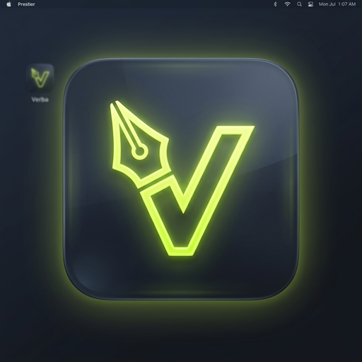

<div align="center">
  

  # Verba

  [](https://github.com/RhythmicDias/Verba/blob/main/LICENSE)
  [](https://github.com/RhythmicDias/Verba/stargazers)
  [](https://github.com/RhythmicDias/Verba/issues)
  [](https://github.com/RhythmicDias/Verba)

  [](https://www.rust-lang.org/)
  [](https://tauri.app/)
  [](https://react.dev/)
  [](https://www.typescriptlang.org/)
  [](https://vite.dev/)

</div>

---

**Verba** is a **fully offline, local-first** AI-powered text-polishing utility built with **Tauri v2**, **React**, **TypeScript**, and **Rust**—with the flexible option to also connect to online LLM providers. It runs silently in your system tray, listens to a global hotkey, instantly captures selected text, polishes it locally or online, and pastes the refined text back to your focused application.

> [!IMPORTANT]
> **100% Offline & Private**: Verba runs completely offline using a built-in `llama-completion` sidecar powered by the `Llama-3.2-1B-Instruct` model—so your text never leaves your device. If you prefer, you can easily configure it to use online cloud providers (like OpenAI, Anthropic, Gemini, or Groq) in the Settings.

## ✨ Features

- **Global Hotkey Activation**: Quickly select any text, press the hotkey (default: `Ctrl+Alt+P`), and watch it load in the Verba popup.
- **AI Text Polishing**: Integrate with top-tier AI LLM providers to clean up grammar, tone, style, or translate text.
- **Local Offline Inference**: Run text polishing completely offline using the lightweight `Llama-3.2-1B-Instruct` model powered by a built-in `llama-completion` sidecar. No API keys or internet connection required!
- **Local Model Downloader**: In-app panel to trigger, track, and cancel model downloads from HuggingFace with live download speeds and progress indicators.
- **Auto-Paste Back**: Seamlessly writes polished text back to your clipboard and injects it back into your active window.
- **Clipboard Preservation**: Backs up and restores your pre-existing clipboard contents automatically, preventing pollution of your copy/paste queue.
- **Keyboard Safety Validation**: Dynamically detects physical keystrokes and waits for hotkey releases before executing `Ctrl+C`, preventing selection replacement bugs (e.g. typing a literal 'c' instead of copying).
- **Anti-Clipping Window Layout**: Custom container layouts with fine-tuned paddings and margins to prevent CSS box-shadow clipping issues on transparent overlays.
- **System Tray Menu**: Run the app in the background with a system tray menu allowing easy access to settings and application exit.
- **Polishing History**: Keep track of previously edited texts for easy reference and reuse.
- **Secure Storage**: Safe handling of API keys using system-native keyring storage via Rust.

## 🤖 Local Offline Inference Setup

Verba supports 100% local, offline text polishing. To use this feature:

1. **Get the Executables**: Download the `llama-completion` executables and dynamic libraries (`.dll`/`.so`/`.dylib`) from the `llama.cpp` releases.
2. **Place Executables & DLLs**:
   - For compilation and bundling, place a renamed binary `llama-completion-<target-triple>.exe` in the [src-tauri/binaries](file:///d:/PythonProjects/Verba/src-tauri/binaries) directory.
   - For active development/runtime, place the dynamic libraries (`llama.dll`, `ggml.dll`, `ggml-cpu-*.dll`, etc.) and `llama-completion.exe` in the active build folder (e.g., [src-tauri/target/debug](file:///d:/PythonProjects/Verba/src-tauri/target/debug) or the production installation folder).
3. **Download the Model**: Launch Verba, go to **Settings**, select the **Local** provider, and click **Download Model** to fetch the 800MB `Llama-3.2-1B-Instruct-Q4_K_M.gguf` model file directly.
4. **Trigger Polishing**: Highlight any text, press your hotkey, select **Generative** (or any local prompt), and watch it polish instantly offline without calling any external APIs.

## 🍏 macOS Compatibility & Setup

Verba is fully compatible with macOS (both Apple Silicon/M1/M2/M3 and Intel chips). Follow these setup requirements:

1. **Global Hotkey**: The default global trigger hotkey on macOS is **`Cmd+Alt+P`** (compared to `Ctrl+Alt+P` on Windows).
2. **Accessibility Permissions**:
   - Because Verba simulates key presses (`Cmd+C` and `Cmd+V`) via AppleScript to capture and paste text automatically, macOS requires **Accessibility Permissions**.
   - Upon first trigger, macOS will prompt you. Go to `System Settings -> Privacy & Security -> Accessibility` and ensure **Verba** is checked/enabled.
   - If keystroke emulation fails to paste, toggle the permission off and back on.
3. **Local Offline Inference Setup (macOS)**:
   - For compilation and bundling, copy the relevant `llama-completion` executable from the target macOS directory (`llama-macos-arm64` or `llama-macos-x64`) into [src-tauri/binaries/](file:///d:/PythonProjects/Verba/src-tauri/binaries) with the corresponding target triple:
     - Apple Silicon (M1/M2/M3/M4): `llama-completion-aarch64-apple-darwin`
     - Intel Macs: `llama-completion-x86_64-apple-darwin`
   - Make sure you also copy the required dynamic libraries (e.g. `libllama-*.dylib`, `libggml-*.dylib`, etc.) to the same directory or system library paths as needed if running from compiled source.

## 🛠️ Tech Stack

- **Desktop Framework**: [Tauri v2](https://tauri.app/) (Rust backend)
- **Local LLM Engine**: [llama.cpp](https://github.com/ggerganov/llama.cpp) via `llama-completion` sidecar
- **Frontend library**: [React](https://react.dev/) with [Vite](https://vite.dev/)
- **Programming Languages**: Rust (Core Logic), TypeScript (UI & Application orchestration)
- **Security**: System Keychain (`keyring-rs`) for API key protection

## 🚀 Quick Start

### Prerequisites

Ensure you have the following installed on your local machine:

1. **Rust & Cargo**: Follow instructions at [rustup.rs](https://rustup.rs/).
2. **Node.js & npm**: Install via [nodejs.org](https://nodejs.org/).
3. **Tauri Prerequisites**: Depending on your OS, install necessary dependencies listed in the [Tauri Getting Started Guide](https://tauri.app/start/prerequisites/).

### Development Setup

1. **Clone the repository**:
   ```bash
   git clone https://github.com/RhythmicDias/Verba.git
   cd Verba
   ```

2. **Install node dependencies**:
   ```bash
   npm install
   ```

3. **Run in development mode**:
   ```bash
   npm run tauri dev
   ```

### Production Build

To build a standalone production-ready package:
```bash
npm run tauri build
```

## 📜 License

Distributed under the **MIT License**. See [LICENSE](file:///d:/PythonProjects/Verba/LICENSE) for more information.
