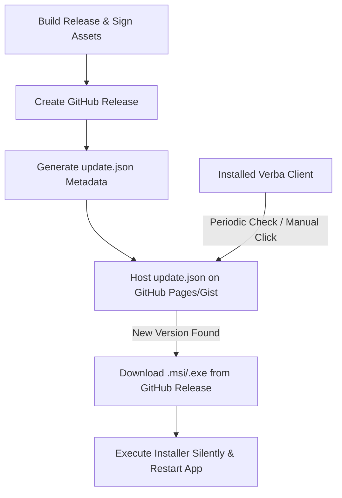

# Implementation & Deployment Plan: Tauri OTA Updater

This document details the plan to implement the Tauri Updater plugin, add "Check for Updates" controls to the settings dashboard and system tray, and outlines the distribution workflow for pushing OTA (over-the-air) updates to Windows clients (`.msi` / `.exe`).

---

## 🛠️ Part 1: Proposed Code Changes

We will install and configure the official Tauri Updater plugin, `@tauri-apps/plugin-updater` (frontend) and `tauri-plugin-updater` (backend).

### 1. Add Updater Options to System Tray
* **Modify**: `src-tauri/src/lib.rs`
  * Add an "Update" option (id: `"update"`) to the system tray context menu.
  * In the tray menu handler, emit a frontend event `trigger-update-check` or handle the check directly in Rust.
  * *Note*: Doing it in Rust is cleaner! The Rust backend can use the `tauri-plugin-updater` API to query, download, and install the update natively, then restart the app.

### 2. Add "Update" Interface to Settings Screen
* **Modify**: `src/components/Settings.tsx`
  * Add an **"Update"** section (tab or section under preferences).
  * Show the current version (e.g. `0.1.0`).
  * Add a **"Check for Updates"** button.
  * Show inline progress during downloading/installing (e.g., "Downloading update (45%)...").

### 3. Register Plugin & Permissions
* **Modify**: `src-tauri/Cargo.toml` & `package.json`
  * Add dependency `tauri-plugin-updater = "2"`.
  * Add NPM dependency `@tauri-apps/plugin-updater` and `@tauri-apps/plugin-process`.
* **Modify**: `src-tauri/tauri.conf.json`
  * Add `"updater"` configuration with signature public key and endpoints.
* **Modify**: `src-tauri/capabilities/default.json`
  * Grant permission `updater:allow-check`, `updater:allow-download-and-install`, and `process:allow-relaunch`.

---

## 🚀 Part 2: Deployment Guide: How Updates are Pushed to Installed MSI/EXE

Once the app is running on a user's machine (installed via `.msi` or `.exe`), updates are delivered over-the-air (OTA) via the following system:



### Steps to Release an Update:

#### 1. Generate Signing Keys (One-Time Setup)
To prevent malicious updates, Tauri requires all update binaries to be signed.
```bash
npx tauri signer generate -g
```
* This creates a public key (to put in `tauri.conf.json`) and a private key (used to sign builds).

#### 2. Compile & Sign the Binaries
When compiling the release on your local rig or CI/CD:
```powershell
# Set environment variables containing your private key and password
$env:TAURI_SIGNING_PRIVATE_KEY="your-private-key-content"
$env:TAURI_SIGNING_PRIVATE_KEY_PASSWORD="your-password"
npm run tauri build
```
Tauri will automatically generate signed installers:
* `verba_0.2.0_x64_en-US.msi`
* `verba_0.2.0_x64_en-US.msi.sig` (The signature file)

#### 3. Upload to GitHub Releases
Upload the compiled `.msi`, `.exe`, and `.sig` files to a public GitHub release (e.g. version `v0.2.0`) in your repo `https://github.com/RhythmicDias/Verba`.

#### 4. Update the Update Manifest (`update.json`)
You must host a JSON file (e.g. on GitHub Pages, Gist, or raw repository file) containing the latest release info. Tauri reads this file to see if there is an update.

Format of `update.json`:
```json
{
  "version": "0.2.0",
  "notes": "Added update functionality and fixed keyring security.",
  "pub_date": "2026-06-09T12:00:00Z",
  "platforms": {
    "windows-x86_64": {
      "signature": "CONTENT_OF_msi.sig_FILE",
      "url": "https://github.com/RhythmicDias/Verba/releases/download/v0.2.0/verba_0.2.0_x64_en-US.msi"
    }
  }
}
```

#### 5. User Client Behavior
* When the client runs a check, it fetches your `update.json`.
* If the version in `update.json` (`0.2.0`) is greater than the running version (`0.1.0`), the client downloads the `.msi` from the `url` value, validates the download against the `signature`, runs the installer in silent mode, and restarts itself.
